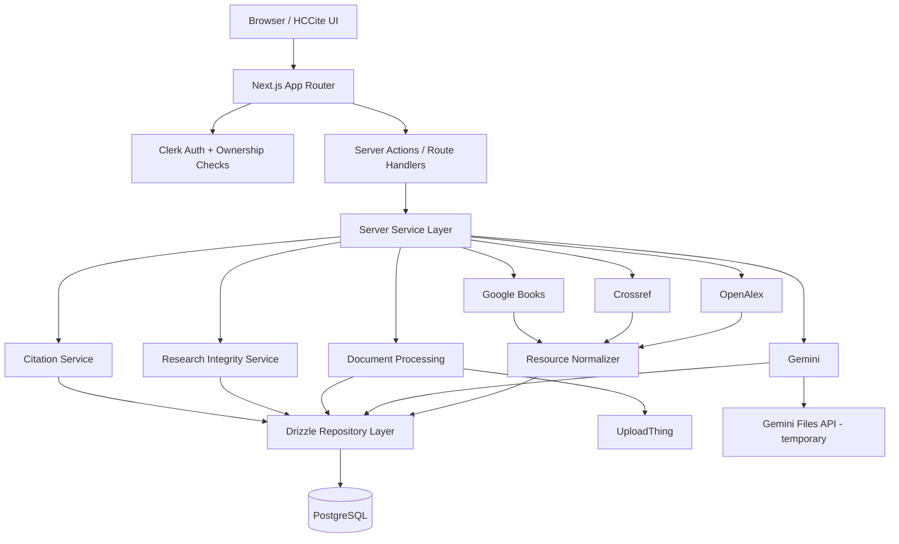
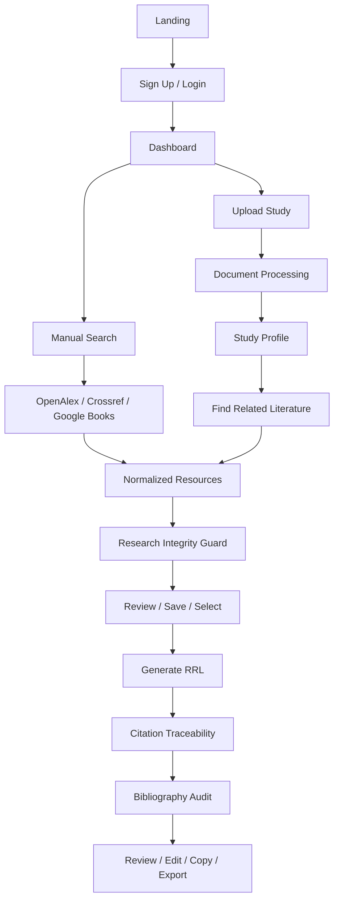
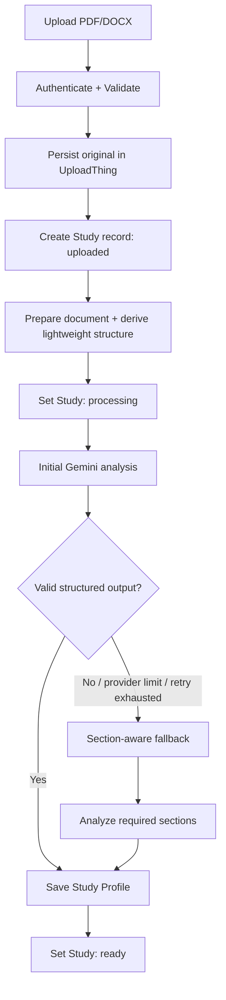
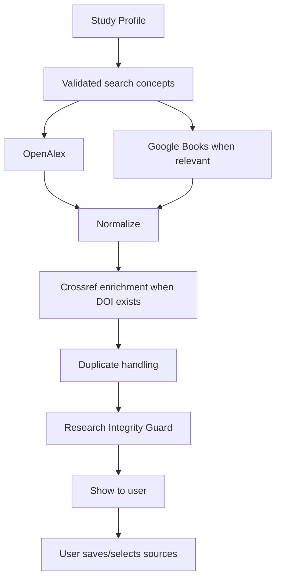

# HCCite

**An Integrated Academic Resource Discovery, Citation Management, and AI-Assisted RRL System**

HCCite is a web-based academic research platform for discovering scholarly articles and books, organizing research materials, generating citations, analyzing uploaded studies, finding related literature, and producing source-grounded AI-assisted Review of Related Literature (RRL) drafts.

The current school-project build is designed to use **free tiers only**.

---

## 1. Core Rules

HCCite separates **AI reasoning** from **bibliographic truth**.

```text
Gemini understands and synthesizes.
Academic APIs provide the source records.
HCCite verifies, stores, traces, and audits.
The user decides what to use.
```

Non-negotiable rules:

- Gemini must not create authoritative bibliographic records.
- Real source metadata must come from OpenAlex, Crossref, or Google Books.
- Final citations must be generated from normalized metadata using Citation.js + CSL.
- An RRL draft may use only sources explicitly selected by the user.
- Retraction/correction status must come from trusted metadata, not Gemini opinion.
- Every generated RRL citation must be traceable to a stored HCCite Resource.
- All user-owned data operations must enforce authentication and ownership.
- API keys and secrets must remain server-side.
- No paid-only service or feature should be introduced into the school-project build.

---

## 2. Main Features

| Feature | Purpose |
| --- | --- |
| Authentication | Email-based sign-up, sign-in, profile, session handling, and logout |
| Unified Academic Search | Search academic articles and books through a consistent HCCite resource model |
| OpenAlex Discovery | Find scholarly works and academic metadata |
| Crossref Lookup | Verify DOI metadata and enrich scholarly records |
| Google Books Discovery | Find books and retrieve ISBN/publisher/book metadata |
| Collections | Organize saved research sources |
| Notes and Tags | Add personal notes, tags, and reading status |
| Citation Generation | Generate APA, MLA, and Chicago references |
| Duplicate Prevention | Prevent duplicate DOI/ISBN/resources |
| My Studies | Store uploaded PDF/DOCX studies and processing state |
| AI Study Analyzer | Create a structured Study Profile from an uploaded study |
| Related Literature Finder | Turn a Study Profile into academic searches |
| Relevance Assistance | Explain why a retrieved source may be relevant |
| Research Integrity Guard | Surface DOI, correction, retraction, and metadata issues |
| AI-Assisted RRL | Synthesize only user-selected source context |
| Citation Traceability | Map generated citations back to stored sources |
| Bibliography Audit | Check RRL references before copy/export |
| Dashboard | Show useful personal research activity and metrics |

---

## 3. Technology Stack

| Purpose | Technology |
| --- | --- |
| Framework | Next.js App Router |
| Starter | Create T3 App |
| Language | TypeScript |
| Styling | Tailwind CSS |
| UI | shadcn/ui |
| Icons | Lucide React |
| Authentication | Clerk |
| Database | PostgreSQL |
| ORM | Drizzle ORM |
| Validation | Zod |
| AI | Google Gemini Developer API |
| Default AI model | `gemini-3.8-flash` |
| Persistent study files | UploadThing |
| Temporary AI file handling | Gemini Files API |
| Scholarly discovery | OpenAlex |
| DOI / bibliographic verification | Crossref REST API |
| Research-integrity metadata | Crossref + Retraction Watch data exposed through Crossref |
| Book discovery | Google Books API |
| Citation formatting | Citation.js + CSL |
| Package manager | pnpm |
| Version control | Git + GitHub |

### Intentional exclusions

The current build does not require:

- tRPC
- NextAuth/Auth.js
- administrator or faculty roles
- paid API plans
- publisher full-text storage
- a separate vector database
- additional academic APIs unless the approved scope changes

---

## 4. Free-Tier Constraints

The implementation must remain inside free usage for the school project.

### Gemini API

Use:

```env
GEMINI_MODEL=gemini-3.8-flash
```

The Gemini API Free Tier currently provides free input/output usage for this model, subject to project rate limits.

Required behavior:

- handle `429 RESOURCE_EXHAUSTED`
- use bounded retry/backoff
- avoid repeatedly sending the same full document
- persist the Study Profile after successful analysis
- never require paid-only Gemini features

Important privacy constraint:

> Gemini Free Tier content may be used by Google to improve its products. HCCite's free-tier school build must therefore use public, sample, synthetic, or otherwise non-confidential study files.

### UploadThing

Use the UploadThing free plan only.

Current free-plan constraints that affect HCCite:

- 2 GB total storage
- files are `public-read`
- private-file ACL is a paid feature
- the default PDF route size is 4 MB unless explicitly configured

For this school build:

- configure the study upload route with an explicit file-size limit
- accept only PDF and DOCX
- authenticate the upload route
- associate every upload with the authenticated user
- automatically delete the stored file when the Study is deleted
- use only non-confidential/demo research files because free-plan files are URL-accessible

Recommended project limit:

```env
MAX_STUDY_FILE_MB=50
```

This limit should be enforced by both the UI and server-side validation.

### OpenAlex

Use a **free OpenAlex API key**.

Do not enable paid usage.

Implementation requirements:

- use `OPENALEX_API_KEY`
- respect the free daily budget
- request only fields HCCite needs
- use efficient pagination
- handle `429` without automatically purchasing/using paid capacity
- do not use OpenAlex content-download features for this project

### Crossref

Use the public/polite REST API only.

No Crossref Metadata Plus subscription is required.

Identify HCCite using:

```env
CROSSREF_MAILTO=
```

### Google Books

Use the public Google Books API with a project API key.

HCCite only needs public book discovery. It does not need Google Books private "My Library" OAuth features.

### Clerk

Use Clerk Hobby/free authentication features only.

HCCite does not require paid authentication features.

---

## 5. External Service Responsibilities

### OpenAlex

Primary scholarly discovery service.

Use it for:

- article/work search
- title
- authors
- publication year
- venue/source
- DOI when available
- OpenAlex ID
- abstract/inverted abstract when available
- open-access information
- citation-related metadata when useful

OpenAlex is for **discovery**, not final integrity judgment.

### Crossref

Primary DOI and scholarly bibliographic verification service.

Use it for:

- DOI lookup
- title/authors
- publisher
- journal/container title
- publication dates
- metadata enrichment
- post-publication updates
- correction/retraction relationships when available
- Retraction Watch-integrated metadata

Crossref does not prove that a publication's scientific conclusions are correct.

### Google Books

Book-specific discovery service.

Use it for:

- title
- authors
- publisher
- publication date
- ISBN-10 / ISBN-13
- description
- cover
- preview/info URL when available

Use Google Books for books and textbooks, not as the main scholarly-article verifier.

### Gemini

AI reasoning and synthesis layer.

Gemini may:

- analyze uploaded studies
- produce structured Study Profiles
- identify research concepts
- suggest academic search queries
- explain source relevance
- synthesize selected sources into an RRL draft
- help identify useful document sections

Gemini must not:

- invent a DOI
- invent a source and persist it as real
- silently fill missing author/publication metadata
- decide that a paper is officially retracted
- generate the authoritative bibliography from free-form text
- use sources outside the selected-source allow-list

### Citation.js + CSL

Use normalized HCCite metadata to produce deterministic:

- APA
- MLA
- Chicago

Gemini-generated citation strings are not authoritative.

---

## 6. High-Level Architecture



### Server-only boundary

Client code must never receive:

- `GEMINI_API_KEY`
- `OPENALEX_API_KEY`
- `GOOGLE_BOOKS_API_KEY`
- `CLERK_SECRET_KEY`
- `UPLOADTHING_TOKEN`
- database credentials

Provider/service modules should be server-only.

---

## 7. Main User Flow



---

## 8. Resource Normalization

All external academic records should be converted into one internal `Resource` shape before the UI or persistence layer depends on them.

### Scholarly work identity

Preferred duplicate identity order:

1. normalized DOI
2. stable provider identifier
3. conservative normalized title + year + primary author

### Book identity

Preferred duplicate identity order:

1. ISBN-13
2. ISBN-10
3. conservative normalized title + year + primary author

### Provenance

Every Resource should retain:

- source provider
- source identifier
- DOI/ISBN when available
- canonical/source URL when available
- retrieval timestamp
- normalized bibliographic metadata

Never discard provenance after normalization.

---

## 9. My Studies and Document Processing

Supported upload types:

- PDF
- DOCX

Unsupported initially:

- legacy `.doc`

### Processing flow



If processing fails, keep the Study record and original UploadThing file and set:

```text
status = failed
processingError = safe error summary
```

Allow the owner to retry.

---

## 10. PDF and DOCX Handling

### PDF

Gemini may receive a PDF as a document input.

For large PDFs:

- upload/reuse the file through Gemini Files API when useful
- Gemini Files API is temporary processing storage only
- UploadThing remains the persistent HCCite copy
- do not depend on the Gemini file reference remaining available permanently

### DOCX

DOCX should be extracted to text on the server before Gemini analysis.

The extractor should preserve useful structure where practical:

- headings
- paragraphs
- section ordering

HCCite does not promise exact interpretation of advanced DOCX formatting.

---

## 11. Study Profile

The initial AI analysis produces a reusable structured Study Profile.

Recommended shape:

```ts
type StudyProfile = {
  title: string | null;
  summary: string;
  researchProblem: string | null;
  objectives: string[];
  keywords: string[];
  methodology: string | null;
  variablesOrConcepts: string[];
  populationOrSample?: string | null;
  majorFindings?: string[];
  conclusion?: string | null;
  suggestedQueries: string[];
  importantPageRanges?: Array<{
    label: string;
    startPage: number;
    endPage: number;
  }>;
};
```

Validate the result with Zod before persistence.

### Reuse rule

After the Study Profile is saved, use it instead of the full source document whenever possible for:

- related-literature search
- keyword/query generation
- relevance comparison
- RRL planning
- dashboard summaries

Do not resend a 30-200 page paper for every AI action.

---

## 12. Section-Aware Fallback

If whole-document processing fails, becomes inefficient, or additional detail is needed, analyze only relevant sections.

Useful sections include:

- Abstract
- Introduction
- Research Problem
- Objectives
- Review of Related Literature
- Methodology
- Results
- Discussion
- Conclusion
- References

Examples:

```text
Research problem/objectives
-> Abstract + Introduction + Problem + Objectives

Methodology
-> Methodology + relevant appendix content

Major findings
-> Results + Discussion + Conclusion

Related-literature discovery
-> Study Profile + keywords + concepts + research problem
```

Arbitrary fixed-page chunking should be the fallback of last resort.

---

## 13. Related Literature Discovery



Gemini can suggest search concepts and explain relevance.

It must not replace OpenAlex/Google Books with invented results.

---

## 14. Research Integrity Guard

Research Integrity Guard evaluates available metadata and tells the user when a scholarly source needs review.

It is **not** a scientific-quality score.

### Data checks

For DOI-based resources, inspect available evidence such as:

- DOI resolution/metadata match
- metadata completeness
- post-publication updates
- correction records
- retraction records
- Retraction Watch/Crossref update information
- metadata changes since the previous check

### Status model

Keep DOI verification separate from research-integrity status.

```ts
type IntegrityStatus =
  | "no_known_issue"
  | "review_required"
  | "corrected"
  | "retracted"
  | "unknown";
```

Examples:

```text
DOI: Verified
Integrity: No known issue
```

```text
DOI: Verified
Integrity: Retracted
Action: Review retraction notice before use
```

`no_known_issue` means no relevant issue was found in the metadata checked at that time. It is not a guarantee of scientific correctness.

`unknown` must never be shown as equivalent to `no_known_issue`.

### Check timing

Run/reuse an integrity check:

- when a DOI source is opened or selected
- before RRL generation
- during Bibliography Audit
- when the stored check is stale

Do not call Crossref on every UI render.

Persist `checkedAt`.

---

## 15. RRL Generation

The RRL generator may receive only:

1. relevant Study Profile context
2. user-selected Resource records
3. available abstracts or permitted source context
4. citation identifiers generated by HCCite
5. selected citation style

### Hard rules

The model must:

- use only selected sources
- avoid introducing new references
- avoid inventing publication facts
- avoid claiming detailed findings when only title-level metadata is available
- state when source context is insufficient
- synthesize by theme/concept rather than outputting disconnected source summaries
- return structured citation keys that HCCite can validate

If HCCite does not have enough source content to support a detailed claim, the generated draft should remain conservative.

---

## 16. Citation Traceability

Every generated citation must map to a stored `Resource`.

The RRL workspace should allow the user to inspect:

- title
- authors
- year
- DOI/ISBN
- source provider
- available abstract/context
- integrity status
- generated citation
- why the source was associated with that RRL section
- latest metadata/integrity check time

Do not store an RRL citation that cannot be mapped back to a Resource.

---

## 17. Bibliography Audit

Before final copy/export, audit the current draft.

Required checks:

- every generated citation maps to a Resource
- no unselected source was introduced
- duplicate references are detected
- DOI verification state is known where applicable
- retracted sources are surfaced
- corrections/notable updates are surfaced
- required bibliography metadata is present
- Citation.js/CSL formatting succeeds

Example result:

```text
Sources selected:           14
Citations mapped:           14/14
DOIs verified:              13/14
Retracted sources:          0
Sources requiring review:   1
Duplicate references:       0
Unselected references:      0

Result: Review required
```

Do not use a generic numeric trust score.

### Audit invalidation

An audit is valid only for the exact RRL content/version that was audited.

Store:

```text
draftVersion
draftContentHash
```

Any edit or regeneration of the RRL must mark the previous audit as stale and require a new audit before final copy/export.

---

## 18. Core Database Model

The exact Drizzle schema may evolve, but these responsibilities must remain.

### `UserProfile`

```text
id
clerkUserId
displayName
createdAt
updatedAt
```

### `Resource`

```text
id
type
title
authors
year
doi
isbn
publisher
venue
source
sourceIdentifier
url
abstract
createdAt
updatedAt
```

Canonical normalized article/book metadata.

### `SavedResource`

```text
id
userId
resourceId
readingStatus
notes
createdAt
updatedAt
```

### `Collection`

```text
id
userId
name
description
createdAt
updatedAt
```

### `CollectionResource`

```text
collectionId
resourceId
addedAt
```

### `Tag`

```text
id
userId
name
```

### `ResourceTag`

```text
savedResourceId
tagId
```

### `Study`

```text
id
userId
title
originalFileName
fileType
fileUrl
fileStorageKey
status
pageCount
processingError
createdAt
updatedAt
```

Study statuses:

```text
uploaded
processing
ready
failed
```

### `StudyAnalysis`

```text
id
studyId
summary
researchProblem
objectives
keywords
methodology
variablesOrConcepts
populationOrSample
majorFindings
conclusion
suggestedQueries
model
analysisVersion
createdAt
updatedAt
```

This is the persistent Study Profile.

### `StudySection`

```text
id
studyId
label
startPage
endPage
normalizedTextReference
createdAt
```

Used for targeted follow-up processing.

### `StudyRelatedSource`

```text
id
studyId
resourceId
relevanceReason
relevanceScore
selectedForRRL
createdAt
updatedAt
```

`relevanceScore` is retrieval/AI relevance, not research integrity.

### `ResourceIntegrityCheck`

```text
id
resourceId
status
doiVerified
updateType
updateDoi
updateLabel
integritySource
metadataComplete
checkedAt
rawMetadataHash
```

### `RRLDraft`

```text
id
studyId
citationStyle
content
model
generationVersion
createdAt
updatedAt
```

### `RRLDraftSource`

```text
draftId
resourceId
selectedAtGeneration
```

Immutable source allow-list for a generation.

### `RRLCitationLink`

```text
id
draftId
resourceId
citationKey
sectionKey
contextSnippet
createdAt
```

### `RRLAudit`

```text
id
draftId
draftVersion
draftContentHash
status
citationsTotal
citationsMapped
doisVerified
retractedCount
reviewRequiredCount
duplicateCount
unselectedReferenceCount
createdAt
```

---

## 19. Planned Screens

### Landing

- product explanation
- features
- supported APIs
- Login
- Sign Up

### Dashboard

- My Studies count
- Saved Sources count
- Collections count
- citations generated
- recent studies/resources
- quick actions

### Research Articles

- OpenAlex search
- filters
- result cards
- DOI/open-access metadata when available
- Save
- Add to Collection
- Generate Citation
- Source Health
- Open Source

### DOI & Citation Lookup

- DOI/title lookup
- Crossref metadata
- duplicate indicator
- update/integrity information
- citation style
- citation preview
- save

### Book Discovery

- title/author/keyword search
- book metadata
- ISBN
- cover
- description
- preview/info link
- save
- citation

### AI Study Analyzer

- PDF/DOCX upload
- validation
- processing state
- Study Profile
- suggested queries
- Find Related Literature

### My Studies

- study list
- upload/processing status
- open analysis
- related sources
- RRL drafts
- delete

### Related Literature Workspace

- generated search concepts
- verified API results
- relevance explanation
- Source Health
- source selection
- Generate RRL

### RRL Workspace

- editable draft
- selected-source panel
- clickable citation traceability
- citation style
- regenerate
- Bibliography Audit
- copy/export

---

## 20. Recommended Project Structure

```text
src/
├── app/
│   ├── (public)/
│   ├── dashboard/
│   ├── research/
│   ├── crossref/
│   ├── books/
│   ├── ai-analyzer/
│   ├── studies/
│   │   └── [studyId]/
│   │       ├── analysis/
│   │       ├── literature/
│   │       └── rrl/
│   ├── collections/
│   └── api/
│
├── components/
│   ├── ui/
│   ├── research/
│   ├── studies/
│   ├── citations/
│   ├── integrity/
│   └── rrl/
│
├── server/
│   ├── db/
│   │   ├── index.ts
│   │   └── schema.ts
│   ├── services/
│   │   ├── openalex.ts
│   │   ├── crossref.ts
│   │   ├── google-books.ts
│   │   ├── gemini.ts
│   │   ├── document-extractor.ts
│   │   ├── document-indexer.ts
│   │   ├── research-integrity.ts
│   │   ├── rrl-audit.ts
│   │   └── citation.ts
│   └── repositories/
│       ├── resources.ts
│       ├── collections.ts
│       ├── studies.ts
│       ├── integrity.ts
│       └── rrl.ts
│
├── lib/
│   ├── validators/
│   ├── constants/
│   └── utils/
│
└── env.ts
```

---

## 21. Environment Variables

Example contract:

```env
# App
NEXT_PUBLIC_APP_URL=http://localhost:3000

# Clerk
NEXT_PUBLIC_CLERK_PUBLISHABLE_KEY=
CLERK_SECRET_KEY=

# PostgreSQL
DATABASE_URL=

# Gemini
GEMINI_API_KEY=
GEMINI_MODEL=gemini-3.8-flash

# UploadThing
UPLOADTHING_TOKEN=

# Academic APIs
OPENALEX_API_KEY=
CROSSREF_MAILTO=
GOOGLE_BOOKS_API_KEY=

# HCCite
MAX_STUDY_FILE_MB=50
INTEGRITY_CHECK_TTL_HOURS=24
```

Never commit real secrets.

The app should validate required environment values at startup.

---

## 22. Security and Privacy

### Authentication and ownership

Every user-specific server mutation/read must verify:

1. Clerk session
2. requested resource ownership

Users may access only their own:

- studies
- study files
- collections
- notes
- tags
- saved-resource state
- source selections
- RRL drafts
- audits

### Upload validation

Validate on the server:

- authenticated user
- file type
- MIME type
- extension
- size
- ownership association

### Free-tier file warning

UploadThing free-plan study files are public by URL, and Gemini Free Tier content may be used to improve Google products.

Therefore the school-project version must clearly tell users:

```text
Do not upload confidential, sensitive, or unpublished research documents.
Use this build only with non-confidential/demo study files.
```

### AI labeling

Clearly label:

- AI-generated Study Profile content
- AI relevance explanations
- AI-assisted RRL drafts

### Data minimization

Send Gemini only the content needed for the current operation.

### Deletion

Deleting a Study should delete/disconnect:

- UploadThing file
- Study record
- StudyAnalysis
- StudySection records
- StudyRelatedSource records
- associated RRL drafts
- citation links
- audits

Deletion must be owner-authorized.

---

## 23. Reliability Rules

External providers are dependencies and may fail.

### General

On temporary provider failure:

- preserve user data
- show a clear retryable state
- do not create corrupted/partial valid records
- do not silently switch to invented data

### Gemini `429`

On rate limit:

1. preserve the Study
2. keep a retryable processing state
3. respect provider retry information when available
4. use bounded exponential backoff
5. prevent duplicate concurrent analysis for the same Study
6. prefer saved Study Profile/targeted sections instead of resending the full document
7. expose manual retry after automatic attempts are exhausted

### OpenAlex quota exhaustion

Do not fall through to paid usage.

Show a clear temporary quota state and retry after the free budget resets.

### Crossref unavailable

Do not mark a source verified.

Use an unavailable/unknown state and allow later re-check.

### Integrity service unavailable

Use:

```text
unknown
```

Never silently convert `unknown` to `no_known_issue`.

### Idempotency

Retries must not create duplicate:

- StudyAnalysis records
- normalized Resources
- RRLDrafts
- audits

---

## 24. AI Structured Output Validation

Gemini should return structured JSON whenever practical.

Example:

```ts
const StudyProfileSchema = z.object({
  title: z.string().nullable(),
  summary: z.string().min(1),
  researchProblem: z.string().nullable(),
  objectives: z.array(z.string()),
  keywords: z.array(z.string()),
  methodology: z.string().nullable(),
  variablesOrConcepts: z.array(z.string()),
  populationOrSample: z.string().nullable().optional(),
  majorFindings: z.array(z.string()).optional(),
  conclusion: z.string().nullable().optional(),
  suggestedQueries: z.array(z.string()),
  importantPageRanges: z
    .array(
      z.object({
        label: z.string(),
        startPage: z.number().int().positive(),
        endPage: z.number().int().positive(),
      }),
    )
    .optional(),
});
```

If validation fails:

- do not persist the malformed result as valid
- use bounded retry if appropriate
- otherwise mark the analysis failed and expose retry

---

## 25. Error Handling

| Scenario | Required behavior |
| --- | --- |
| OpenAlex unavailable/quota exhausted | Retryable state; preserve current results/user data |
| Crossref unavailable | Verification/integrity becomes unavailable or unknown |
| Google Books unavailable | Retryable error |
| Gemini unavailable | Preserve Study and allow retry |
| Gemini rate limited | Backoff/retry without duplicate processing |
| Invalid PDF/DOCX | Reject before AI processing |
| File exceeds configured limit | Reject with a clear file-size message |
| AI schema validation fails | Bounded retry, then mark failed |
| No related literature | Empty state + allow query editing |
| Missing DOI | Keep available metadata; DOI verification unavailable |
| Incomplete metadata | Show missing fields honestly |
| Duplicate source | Reuse/link existing Resource |
| Retracted source | High-visibility warning before RRL use |
| Correction found | Show update and source link when available |
| Integrity check unavailable | `unknown` |
| Citation formatting fails | Allow metadata review/retry |
| RRL contains unmapped citation | Bibliography Audit fails |
| Draft changed after audit | Previous audit becomes stale |

---

## 26. Coding Agent Contract

Any coding agent working on this repository should follow these rules.

### Architecture

- Keep provider integrations in server service modules.
- Keep normalized domain models independent from provider response shapes.
- Keep database access behind repositories or a consistent data-access layer.
- Keep secrets out of client components.
- Reuse existing components/services before introducing duplicates.
- Do not add a new provider when an approved provider already covers the requirement.

### Scope

Do not add or replace major technologies without approval.

Do not introduce:

- paid-only features
- another LLM provider
- another academic search API
- a separate admin/faculty system
- a vector database
- background infrastructure that creates a paid dependency

### Academic integrity

- Never persist an AI-invented reference as a Resource.
- Never label a publication scientifically "verified."
- Use `no_known_issue` for a clean integrity check.
- Preserve source provenance.
- RRL generation must enforce the selected-source allow-list.
- Bibliography Audit must operate on the exact current draft version/hash.

### Data and auth

- Check Clerk authentication server-side.
- Check ownership server-side.
- Validate external input with Zod.
- Treat provider responses as untrusted input.
- Delete associated records/files safely when deleting a Study.

### Free-tier efficiency

- Avoid repeated full-document Gemini calls.
- Cache/reuse normalized public metadata where appropriate.
- Reuse Study Profiles.
- Avoid unnecessary Crossref calls on every render.
- Respect OpenAlex and Gemini quota/rate-limit errors.
- Do not automatically activate paid usage.

### UI

- Clearly distinguish:
  - verified DOI metadata
  - integrity status
  - AI-generated explanations
  - AI-assisted draft content
- Loading, empty, error, retry, and stale states are required.
- Never show `unknown` as success.
- Retracted sources require a prominent warning.

---

## 27. Implementation Order

Implement in this order unless an existing codebase dependency requires a small adjustment:

1. Next.js/T3 foundation and shared UI
2. Clerk authentication and ownership helpers
3. PostgreSQL + Drizzle schema
4. OpenAlex service
5. Crossref service
6. Google Books service
7. Resource normalization and duplicate prevention
8. Citation.js + CSL
9. Collections / notes / tags
10. UploadThing My Studies upload flow
11. PDF/DOCX document-processing layer
12. Gemini Study Profile
13. Related Literature Finder
14. Research Integrity Guard
15. Selected-source RRL generation
16. Citation Traceability
17. Bibliography Audit
18. Dashboard metrics
19. Manual QA, error states, quota testing, and responsive polish

---

## 28. Minimum Acceptance Criteria

The school-project build is ready when:

- users can sign up/sign in and protected routes work
- user-owned data cannot be read or mutated by another user
- OpenAlex article search works
- Crossref DOI lookup works
- Google Books discovery works
- Resources are normalized and duplicates are handled
- APA/MLA/Chicago citation generation works
- PDF/DOCX study upload works within the configured free-tier limit
- deleting a Study removes its stored file and related records
- Gemini creates a Zod-validated Study Profile
- long documents are not unnecessarily reprocessed
- related-literature searches use Study Profile concepts
- retrieved results preserve provider provenance
- Research Integrity Guard surfaces corrections/retractions when metadata provides them
- integrity failures/unavailable checks do not display as success
- RRL generation uses only user-selected sources
- generated citations map back to Resources
- editing/regenerating a draft invalidates its old audit
- Bibliography Audit detects unmapped/duplicate/unselected/problematic references
- external API failures and quota limits produce recoverable states
- the app clearly warns that the free-tier school build is for non-confidential study files
- desktop and mobile layouts remain usable

---

## 29. Official Implementation References

Use current official documentation when implementing provider-specific details because limits and APIs can change.

- Gemini API pricing: https://ai.google.dev/gemini-api/docs/pricing
- Gemini document processing: https://ai.google.dev/gemini-api/docs/document-processing
- Gemini Files API: https://ai.google.dev/gemini-api/docs/files
- OpenAlex API authentication/pricing: https://help.openalex.org/api/authentication/
- Crossref REST API: https://www.crossref.org/documentation/retrieve-metadata/rest-api/
- Crossref access/authentication: https://www.crossref.org/documentation/retrieve-metadata/rest-api/access-and-authentication/
- Crossref Retraction Watch: https://www.crossref.org/documentation/retrieve-metadata/retraction-watch/
- Google Books API: https://developers.google.com/books/docs/v1/using
- UploadThing Next.js App Router setup: https://docs.uploadthing.com/getting-started/appdir
- UploadThing file routes: https://docs.uploadthing.com/file-routes
- UploadThing ACL: https://docs.uploadthing.com/concepts/regions-acl
- Clerk pricing: https://clerk.com/pricing

---

## 30. Final Build Definition

HCCite is a Next.js/TypeScript academic research application using:

```text
Clerk
    -> authentication

OpenAlex
    -> scholarly discovery

Crossref
    -> DOI/bibliographic verification
    -> correction/retraction metadata

Google Books
    -> book discovery

UploadThing Free
    -> persistent non-confidential school-project files

Gemini Files API
    -> temporary Gemini file handling

Gemini 3.8 Flash Free Tier
    -> study understanding
    -> structured Study Profile
    -> search-query assistance
    -> relevance explanation
    -> selected-source RRL synthesis

Citation.js + CSL
    -> deterministic APA/MLA/Chicago formatting

PostgreSQL + Drizzle
    -> HCCite application state
```

The project should remain **free-tier only**, source-grounded, auditable, and safe against AI-invented references while remaining simple enough to implement and demonstrate as a school project.
